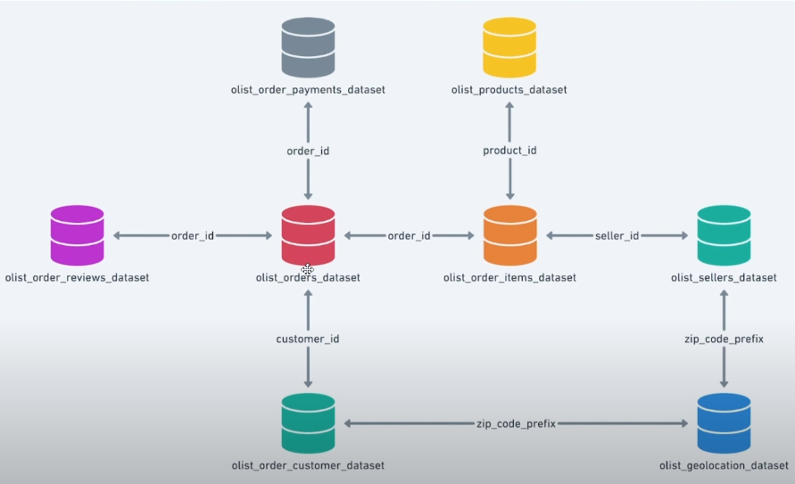

# 🛒 Target E-Commerce SQL End-to-End Project



## 📚 Overview
This repository contains a **real-world SQL analytics project** built on an e-commerce dataset modeled after **Target**.  
The dataset covers **100k+ orders** and eight inter-related tables.  
Using **Google BigQuery**, we perform exploratory analysis and advanced SQL queries to uncover insights that improve **operations, logistics, pricing, and customer experience**.

The work is divided into:
1. **Data Understanding** – exploring each CSV and its schema.  
2. **Problem Statement** – defining actionable business questions.  
3. **Implementation** – executing SQL queries in BigQuery Sandbox.

---

## 🗂 Dataset & Schema
The project uses the Brazilian Olist dataset (mirroring Target’s structure).  
Tables and key columns:

| Table | Description | Key Columns |
|-------|-------------|------------|
| `olist_orders_dataset`        | Master order info | `order_id`, `customer_id`, `order_status`, timestamps |
| `olist_order_items_dataset`   | Items per order | `order_id`, `product_id`, `seller_id`, `price`, `freight_value` |
| `olist_order_reviews_dataset` | Customer reviews | `order_id`, `review_score`, `review_comment_title` |
| `olist_order_payments_dataset`| Payments & installments | `order_id`, `payment_type`, `payment_installments`, `payment_value` |
| `olist_products_dataset`      | Product catalog | `product_id`, `product_category_name`, dimensions |
| `olist_sellers_dataset`       | Seller info | `seller_id`, `zip_code_prefix`, city, state |
| `olist_order_customer_dataset`| Customer info | `customer_id`, `customer_unique_id`, city, state |
| `olist_geolocation_dataset`   | Geolocation | `zip_code_prefix`, `lat`, `lng`, `city`, `state` |

The ER diagram above (`Data_link.png`) illustrates all relationships and foreign keys.

---

## 🎯 Objectives
As a **data analyst for Target**, the mission is to:
* Import all eight CSV tables into BigQuery.
* Explore data types, ranges, and structure.
* Answer complex **business and logistics questions**.
* Provide **actionable recommendations** to boost revenue and customer satisfaction.

---

## 🔑 Analyses & SQL Tasks
The transcript walks through every step, each implemented in SQL:

1. **Exploratory Data Analysis** – data types, time range of orders, customer locations.  
2. **Order Trends** – monthly growth, seasonal peaks, and peak ordering hours.  
3. **Regional Insights** – month-on-month orders by state, customer distribution.  
4. **Economic Impact** – % increase in payments (2017 → 2018), total/average price and freight by state.  
5. **Delivery Performance** – delivery time, difference vs. estimated, top/lowest states by freight and delivery speed.  
6. **Payment Analysis** – monthly orders by payment type, orders by number of installments.

All SQL queries are included in the transcript and can be executed directly in BigQuery.

---

## 🛠 Tech Stack
* **Google BigQuery Sandbox** – free, serverless data warehouse.
* **Standard SQL** – for all transformations and insights.
* Dataset: [Olist Brazilian E-commerce](https://www.kaggle.com/olistbr/brazilian-ecommerce) (public).

---

## ▶️ How to Run

### 1️⃣ Clone the Repository
```bash
git clone https://github.com/<your-username>/target-sql-analysis.git
cd target-sql-analysis
```

### 2️⃣ Set Up BigQuery
Create a **Google Cloud** account and enable **BigQuery Sandbox**.  
Create a dataset, for example: **`target_sql`**.

## 3️⃣ Upload Data
* Download all eight CSV files.
* In BigQuery, **create tables** for each CSV and select **Auto-detect schema**.

## 4️⃣ Execute Queries
* Use the provided SQL scripts or copy queries from this README/transcript.
* View results directly in the **BigQuery console**.

---

## 📊 Key Insights
* **August** shows the highest order volume (~10.8k orders).  
* Customers place most orders in the **afternoon (3-5 PM)**.  
* Total payments increased by **~137%** from **Jan–Aug 2017** to **Jan–Aug 2018**.  
* Certain states exhibit **high freight costs** and **slower deliveries**, highlighting opportunities to optimize logistics.

---

## 💡 Recommendations
* Run **marketing campaigns** in **August** and during **afternoon hours**.  
* Focus on **states with high freight value** to reduce shipping costs.  
* Encourage **digital payments** to align with popular customer behavior.
